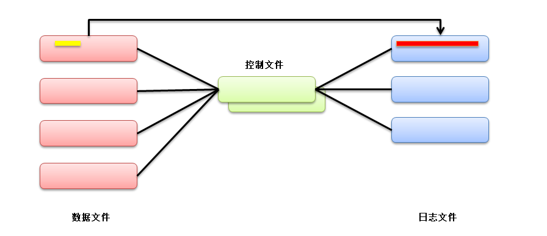
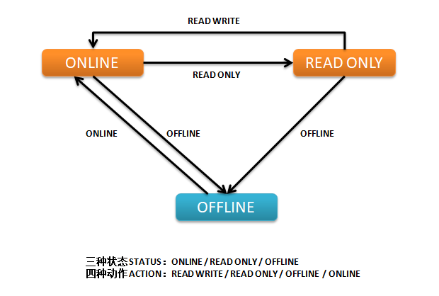

# 数据文件

> 2019-12-21 - BoobooWei

<!-- TOC depthFrom:1 depthTo:6 withLinks:1 updateOnSave:1 orderedList:0 -->

- [关于数据文件](#关于数据文件)
	- [数据文件](#数据文件)
	- [实践1-建立新的表空间](#实践1-建立新的表空间)
	- [实践2-更改表空间的名称，更改数据文件的名称](#实践2-更改表空间的名称，更改数据文件的名称)

<!-- /TOC -->

## 关于数据文件

[关于数据文件](https://docs.oracle.com/en/database/oracle/oracle-database/12.2/admin/managing-data-files-and-temp-files.html#GUID-B1805034-94ED-4887-94B4-369FB8AAE416)

数据文件是操作系统的物理文件，用于存储数据库中所有逻辑结构的数据。必须为每个表空间显式创建它们。

Oracle数据库为每个数据文件分配两个关联的文件号，一个绝对文件号和一个相对文件号，用于唯一地标识它。下表描述了这些数字：

| 文件编号类型 | 描述                                                         |
| ------------ | ------------------------------------------------------------ |
| 绝对         | 唯一标识数据库中的数据文件。该文件号可以在许多引用数据文件的SQL语句中使用，而不是使用文件名。绝对文件号可以在找到`FILE# `所述的柱`V$DATAFILE`或`V$TEMPFILE`视图，或者在`FILE_ID`所述的柱`DBA_DATA_FILES`或`DBA_TEMP_FILES`视图。 |
| 相对的       | 唯一标识表空间内的数据文件。对于中小型数据库，相对文件号通常具有与绝对文件号相同的值。但是，当数据库中的数据文件数超过阈值（通常为1023）时，相对文件数与绝对文件数不同。在bigfile表空间中，相对文件号始终为1024（在OS / 390平台上为4096）。 |

**父主题：** [管理数据文件的准则](https://docs.oracle.com/en/database/oracle/oracle-database/12.2/admin/managing-data-files-and-temp-files.html#GUID-BB7D8910-FCAE-4DAD-BDE5-B5EE35C69C6B)


* 数据文件是数据的存放载体 
* 数据文件存在于操作系统上,可以不是文件。设备也可以。 
* 数据文件不能独立存在,得有组织 数据文件的逻辑组织形式为表空间`tablespace`
* 一个表空间内可以含有多个数据文件 数据库内可以有多个表空间



* 红色是存放数据的数据文件 
* 红色的变化存放在蓝色的日志文件 
* 绿色为控制文件，存放红色和蓝色的结构和行为。


## 实践1-建立新的表空间

该实验的目的是初步认识数据文件和表空间。

### 查看表空间和数据文件的信息 

```SQL
SELECT 
    tablespace_name, file_name, CEIL(bytes / 1024 / 1024) mb
FROM
    dba_data_files
ORDER BY 1;
```

### 建立新的表空间

```sql
CREATE TABLESPACE <tablespace_name> DATAFILE '<datafile_path>' SIZE 2M;
```

### 加入新的数据文件

```sql
ALTER TABLESPACE <tablespace_name> ADD DATAFILE '<datafile_path>' SIZE 2M;
```

### 删除数据文件

Oracle版本 小于 10g 时，数据文件只能加入，不能删除，除非将表空间删除。

Oracle版本 从10g数据库版本开始可以删除。

```SQL
ALTER TABLESPACE <tablespace_name> DROP DATAFILE '<datafile_path>';
```

### 改变数据文件的大小

改变数据文件的大小 可以加大，也可以缩小

```sql
ALTER DATABASE DATAFILE '<datafile_path>' RESIZE 3M;
```

3M为最后的大小，不是加大3M。

* 一个数据文件的最小值为文件头加最小的表；
* 一个数据文件的最大值为该表空间的块大小乘4M。

### 数据文件的自动扩展

查看表空间数据文件自动拓展属性

```sql
SELECT 
    file_name, autoextensible, maxblocks, increment_by
FROM
    dba_data_files;
```

修改数据库文件为自动拓展

```sql
alter database datafile '/home/oracle/ts1.dbf' autoextend on next 1m maxsize 100m;
```

关闭数据文件自动扩展功能

```sql
alter database datafile '/home/oracle/ts1.dbf' autoextend off;
```

### 修改表空间状态

查看表空间状态`status`属性

```sql
select tablespace_name,status from dba_tablespaces;
```

修改表空间的状态为只读

```sql
alter tablespace ts1 read only;
```

修改表空间状态为读写

```sql
alter tablespace ts1 read write;
```

* 只读表空间内的表不能DML，但可以DROP 。
* 因为DROP操作的是SYSTEM表空间，SYSTEM表空间不能设为只读。

修改表空间状态为离线

```sql
alter tablespace ts1 offline;
```

修改表空间状态为在线

```sql
alter tablespace ts1 online;
```




## 实践2-更改表空间的名称，更改数据文件的名称
