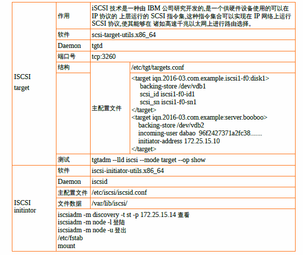
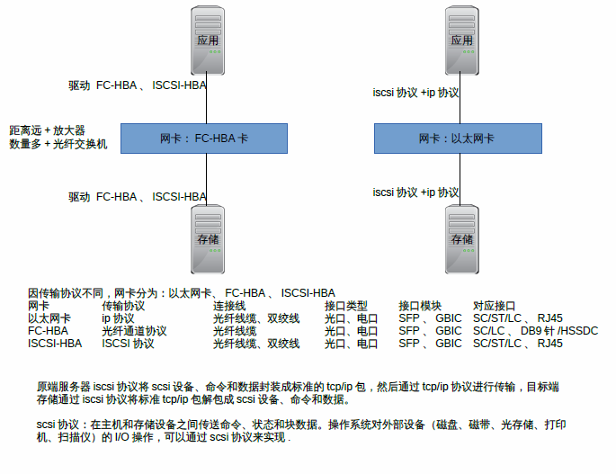

# 搭建ISCSI2Nodes + LVM的镜像模式实现Failover

> 2020.01.04 BoobooWei

[TOC]

## iSCSI简介

iSCSI服务器称为“Target（目标器）”，它提供服务器上的存储共享。iSCSI客户端称为“Initiator（发起程序）”，它访问目标器共享的存储。市场中有卖的用于大型存储服务如SAN的iSCSI适配器。 

- iSCSI target：就是储存设备端，存放磁盘或 RAID 的设备，目前也能够将 Linux 主机仿真成 iSCSI target 了！目的在提供其他主机使用的**磁盘**；
-  iSCSI initiator：就是能够使用 target 的客户端，通常是服务器。 也就是说，想要连接到 iSCSI target 的服务器，也必须要安装 iSCSI initiator 的相关功能后才能够使用 iSCSI target 提供的磁盘就。



### ISCSI target

| 作用       | iSCSI 技术是一种由 IBM 公司研究开发的,是一个供硬件设备使用的可以在 IP 协议的 上层运行的 SCSI 指令集,这种指令集合可以实现在 IP 网络上运行 SCSI 协议,使其能够在 诸如高速千兆以太网上进行路由选择。 |
| ---------- | ------------------------------------------------------------ |
| 软件       | `scsi-target-utils.x86_64`                                   |
| Daemon     | `tgtd`                                                       |
| 端口号     | `tcp:3260`                                                   |
| 主配置文件 | `/etc/tgt/targets.conf`                                      |

常用命令

```bash
tgtadm --lld iscsi --mode target --op show
```


### ISCSI initintor

|    ISCSI initintor         |                                                              |
| ---------- | ------------------------------------------------------------ |
| 软件       | `iscsi-initiator-utils.x86_64`                               |
| Daemon     | `iscsid`                                                     |
| 主配置文件 | `/etc/iscsi/iscsid.conf`                                     |
| 文件数据   | `/var/lib/iscsi/`                                            |

常用命令

```bash
iscsiadm -m discovery -t st -p 172.25.15.14 #查看
iscsiadm -m node -l #登陆
iscsiadm -m node -u #登出
/etc/fstab
mount
```


### 图解




## iSCSI 服务端配置

> 2个节点都要配置

| hostname | IP地址           |
| -------- | ---------------- |
| `iscsi`  | `192.168.14.148` |
| `iscsi2` | `192.168.14.149` |

### 操作系统和内核信息

```bash
[root@iscsi ~]# uname -a
Linux iscsi 2.6.32-573.el6.x86_64 #1 SMP Wed Jul 1 18:23:37 EDT 2015 x86_64 x86_64 x86_64 GNU/Linux
[root@iscsi ~]# cat /etc/redhat-release 
Red Hat Enterprise Linux Server release 6.7 (Santiago)
```

### 查看内核是否支持`iscsi_tcp`

```bash
[root@iscsi ~]# cat /boot/config-`uname -r` | grep CONFIG_ISCSI_TCP
CONFIG_ISCSI_TCP=m
[root@iscsi ~]# lsmod | grep scsi
mptscsih               36638  1 mptspi
mptbase                93615  2 mptspi,mptscsih
scsi_transport_spi     25447  1 mptspi
```

* `=m`代表支持;
* `CONFIG_ISCSI_TCP is not set`表示没有支持 

### 查看系统中可用的磁盘

```bash
[root@iscsi ~]# fdisk -l

Disk /dev/sda: 32.2 GB, 32212254720 bytes
255 heads, 63 sectors/track, 3916 cylinders
Units = cylinders of 16065 * 512 = 8225280 bytes
Sector size (logical/physical): 512 bytes / 512 bytes
I/O size (minimum/optimal): 512 bytes / 512 bytes
Disk identifier: 0x00036f02

   Device Boot      Start         End      Blocks   Id  System
/dev/sda1   *           1          39      307200   83  Linux
Partition 1 does not end on cylinder boundary.
/dev/sda2              39         430     3145728   82  Linux swap / Solaris
Partition 2 does not end on cylinder boundary.
/dev/sda3             430        3917    28003328   83  Linux

Disk /dev/sdb: 107.4 GB, 107374182400 bytes
255 heads, 63 sectors/track, 13054 cylinders
Units = cylinders of 16065 * 512 = 8225280 bytes
Sector size (logical/physical): 512 bytes / 512 bytes
I/O size (minimum/optimal): 512 bytes / 512 bytes
Disk identifier: 0x00000000
```

`/dev/sdb` 107.4GB，计划将该盘划分一个分区

### 划分分区

本文档中，使用单一分割槽 (partition) 分享为磁盘； 还有其他分享方式：

- 使用 dd 指令所建立的大型档案可供仿真为磁盘 (无须预先格式化)；
-  使用单一分割槽 (partition) 分享为磁盘；
-  使用单一完整的磁盘 (无须预先分割)；
- 使用磁盘阵列分享 (其实与单一磁盘相同方式)；
- 使用软件磁盘阵列 (software raid) 分享成单一磁盘；
- 使用 LVM 的 LV 装置分享为磁盘。

先划分出3个区，分别为20G、20G、10G

```bash
[root@iscsi ~]# fdisk /dev/sdb
   Device Boot      Start         End      Blocks   Id  System
/dev/sdb1               1        2612    20980858+  83  Linux
/dev/sdb2            2613        5224    20980890   83  Linux
/dev/sdb3            5225        6530    10490445   83  Linux

[root@iscsi ~]# ll /dev/sdb*
brw-rw---- 1 root disk 8, 16 Jan  4 17:12 /dev/sdb
brw-rw---- 1 root disk 8, 17 Jan  4 17:12 /dev/sdb1
brw-rw---- 1 root disk 8, 18 Jan  4 17:12 /dev/sdb2
brw-rw---- 1 root disk 8, 19 Jan  4 17:12 /dev/sdb3
```

### 安装软件`scsi-target-utils`

```bash
root@iscsi ~]# yum list|grep scsi
iscsi-initiator-utils.x86_64           6.2.0.873-14.el6              local.repo 
lsscsi.x86_64                          0.23-3.el6                    local.repo 
scsi-target-utils.x86_64               1.0.24-16.el6                 local.repo 
root@iscsi ~]# yum install -y scsi-target-utils
[root@iscsi ~]# rpm -ql scsi-target-utils
/etc/rc.d/init.d/tgtd
/etc/sysconfig/tgtd
/etc/tgt/targets.conf
/usr/sbin/tgt-admin
/usr/sbin/tgt-setup-lun
/usr/sbin/tgtadm
/usr/sbin/tgtd
/usr/sbin/tgtimg
/usr/share/doc/scsi-target-utils-1.0.24
/usr/share/doc/scsi-target-utils-1.0.24/README
/usr/share/doc/scsi-target-utils-1.0.24/README.iscsi
/usr/share/doc/scsi-target-utils-1.0.24/README.iser
/usr/share/doc/scsi-target-utils-1.0.24/README.lu_configuration
/usr/share/doc/scsi-target-utils-1.0.24/README.mmc
/usr/share/man/man5/targets.conf.5.gz
/usr/share/man/man8/tgt-admin.8.gz
/usr/share/man/man8/tgt-setup-lun.8.gz
/usr/share/man/man8/tgtadm.8.gz
```

### 修改配置文件

iSCSI 有一套自己分享 target 档名的定义，基本上，藉由 iSCSI 分享出来的 target 檔名都是以 iqn 为开头，意思是：`iSCSI Qualified Name (iSCSI 合格名称)`的意思。那么在 iqn 后面要接啥档名呢？通常是这样的：

```bash
iqn.yyyy-mm.<reversed domain name>:identifier 
iqn.年年-月.单位网域名的反转写法 :这个分享的target名称
```

我做这个测试的时间是 2020年1月份，然后机器`iscsi.com`，反转网域写法为 `com.iscsi`， 然后，想要的 iSCSI target 名称是 `oracle`，那么就可以这样写：

```bash
iqn.2020-001.com.iscsi:oracle
```

可通过命令`man tgt-admin `查看帮助

```bash
[root@iscsi ~]# vim /etc/tgt/targets.conf
<target iqn.2020-001.com.iscsi:oracle>
backing-store /dev/sdb1
backing-store /dev/sdb2
backing-store /dev/sdb3
</target>
```

### 启动`tgtd`服务

```bash
[root@iscsi ~]# service tgtd start
Starting SCSI target daemon:                               [  OK  ]
[root@iscsi ~]# chkconfig tgtd on
[root@iscsi ~]# chkconfig --list|grep tgtd
tgtd           	0:off	1:off	2:on	3:on	4:on	5:on	6:off
[root@iscsi ~]# service tgtd status
tgtd (pid 6839 6838) is running...
[root@iscsi ~]# ps -ef|grep tgtd
root       6838      1  0 17:00 ?        00:00:00 tgtd
root       6839   6838  0 17:00 ?        00:00:00 tgtd
root       6876   6768  0 17:01 pts/0    00:00:00 grep tgtd
[root@iscsi ~]# ss -luntp| grep tgtd
tcp    LISTEN     0      128                   :::3260                 :::*      users:(("tgtd",6838,5),("tgtd",6839,5))
tcp    LISTEN     0      128                    *:3260                  *:*      users:(("tgtd",6838,4),("tgtd",6839,4))
```

### 查看共享存储

```bash
[root@iscsi ~]# tgtadm --lld iscsi --mode target --op show
Target 1: iqn.2020-001.com.iscsi:oracle
    System information:
        Driver: iscsi
        State: ready
    I_T nexus information:
    LUN information:
        LUN: 0
            Type: controller
            SCSI ID: IET     00010000
            SCSI SN: beaf10
            Size: 0 MB, Block size: 1
            Online: Yes
            Removable media: No
            Prevent removal: No
            Readonly: No
            Backing store type: null
            Backing store path: None
            Backing store flags: 
        LUN: 1
            Type: disk
            SCSI ID: IET     00010001
            SCSI SN: beaf11
            Size: 21484 MB, Block size: 512
            Online: Yes
            Removable media: No
            Prevent removal: No
            Readonly: No
            Backing store type: rdwr
            Backing store path: /dev/sdb1
            Backing store flags: 
        LUN: 2
            Type: disk
            SCSI ID: IET     00010002
            SCSI SN: beaf12
            Size: 21484 MB, Block size: 512
            Online: Yes
            Removable media: No
            Prevent removal: No
            Readonly: No
            Backing store type: rdwr
            Backing store path: /dev/sdb2
            Backing store flags: 
        LUN: 3
            Type: disk
            SCSI ID: IET     00010003
            SCSI SN: beaf13
            Size: 10742 MB, Block size: 512
            Online: Yes
            Removable media: No
            Prevent removal: No
            Readonly: No
            Backing store type: rdwr
            Backing store path: /dev/sdb3
            Backing store flags: 
    Account information:
    ACL information:
        ALL
```

## Oracle RAC节点使用共享存储块

### 操作系统和内核信息

```bash
root@node1 ~]# uname -a
Linux node1 2.6.32-573.el6.x86_64 #1 SMP Wed Jul 1 18:23:37 EDT 2015 x86_64 x86_64 x86_64 GNU/Linux
[root@node1 ~]# cat /etc/redhat-release 
Red Hat Enterprise Linux Server release 6.7 (Santiago)
```

### 查看内核是否支持`iscsi_tcp`

```bash
[root@node1 ~]# cat /boot/config-`uname -r` | grep CONFIG_ISCSI_TCP
CONFIG_ISCSI_TCP=m
[root@node1 ~]# lsmod | grep scsi
mptscsih               36638  1 mptspi
mptbase                93615  2 mptspi,mptscsih
scsi_transport_spi     25447  1 mptspi
```

- `=m`代表支持;
- `CONFIG_ISCSI_TCP is not set`表示没有支持 

### 安装软件`iscsi-initiator-utils`

```bash
[root@node1 ~]# yum list|grep iscsi
iscsi-initiator-utils.x86_64           6.2.0.873-14.el6              local.repo 
[root@node1 ~]# yum install -y lsscsi
[root@node1 ~]# yum install -y iscsi-initiator-utils
[root@node1 ~]# rpm -ql iscsi-initiator-utils
/etc/NetworkManager
/etc/NetworkManager/dispatcher.d
/etc/NetworkManager/dispatcher.d/04-iscsi
/etc/iscsi
/etc/iscsi/iscsid.conf
/etc/logrotate.d/iscsiuiolog
/etc/rc.d/init.d/iscsi
/etc/rc.d/init.d/iscsid
/sbin/brcm_iscsiuio
/sbin/iscsi-iname
/sbin/iscsiadm
/sbin/iscsid
/sbin/iscsistart
/sbin/iscsiuio
/usr/lib64/libiscsi.so.0
/usr/lib64/python2.6/site-packages/libiscsimodule.so
/usr/share/doc/iscsi-initiator-utils-6.2.0.873
/usr/share/doc/iscsi-initiator-utils-6.2.0.873/README
/usr/share/man/man8/iscsi-iname.8.gz
/usr/share/man/man8/iscsiadm.8.gz
/usr/share/man/man8/iscsid.8.gz
/usr/share/man/man8/iscsistart.8.gz
/usr/share/man/man8/iscsiuio.8.gz
/var/lib/iscsi
/var/lib/iscsi/ifaces
/var/lib/iscsi/isns
/var/lib/iscsi/nodes
/var/lib/iscsi/send_targets
/var/lib/iscsi/slp
/var/lib/iscsi/static
/var/lock/iscsi
```

### 启动服务`iscsid`

```bash
[root@node1 ~]# chkconfig --list | grep iscsi
iscsi          	0:off	1:off	2:off	3:on	4:on	5:on	6:off
iscsid         	0:off	1:off	2:off	3:on	4:on	5:on	6:off
[root@node1 ~]# iscsiadm -m discovery -t st -p 192.168.14.148
Starting iscsid:                                           [  OK  ]
192.168.14.148:3260,1 iqn.2020-001.com.iscsi:oracle
[root@node1 ~]# iscsiadm -m discovery -t st -p 192.168.14.149
192.168.14.149:3260,1 iqn.2020-001.com.iscsi2:oracle
```

### 登陆共享存储

```bash
[root@node1 ~]# iscsiadm -m node -l
Logging in to [iface: default, target: iqn.2020-001.com.iscsi:oracle, portal: 192.168.14.148,3260] (multiple)
Logging in to [iface: default, target: iqn.2020-001.com.iscsi2:oracle, portal: 192.168.14.149,3260] (multiple)
Login to [iface: default, target: iqn.2020-001.com.iscsi:oracle, portal: 192.168.14.148,3260] successful.
Login to [iface: default, target: iqn.2020-001.com.iscsi2:oracle, portal: 192.168.14.149,3260] successful.
```

### 查看SCSI设备 

```bash
[root@node1 ~]# lsscsi
[0:0:0:0]    disk    VMware,  VMware Virtual S 1.0   /dev/sda 
[4:0:0:0]    cd/dvd  NECVMWar VMware SATA CD01 1.00  /dev/sr0 
[34:0:0:0]   storage IET      Controller       0001  -       
[34:0:0:1]   disk    IET      VIRTUAL-DISK     0001  /dev/sdb 
[34:0:0:2]   disk    IET      VIRTUAL-DISK     0001  /dev/sdc 
[34:0:0:3]   disk    IET      VIRTUAL-DISK     0001  /dev/sdd 
[35:0:0:0]   storage IET      Controller       0001  -       
[35:0:0:1]   disk    IET      VIRTUAL-DISK     0001  /dev/sde 
[35:0:0:2]   disk    IET      VIRTUAL-DISK     0001  /dev/sdf 
[35:0:0:3]   disk    IET      VIRTUAL-DISK     0001  /dev/sdg 
```

从返回的信息可以看到，已成功获取了6块共享存储设备。

### LVM镜像模式

| 服务器   | 共享存储块      | pv              | vg      | lv          |
| -------- | --------------- | --------------- | ------- | ----------- |
| `iscsi`  | ` /dev/sd[bcd]` | ` /dev/sd[bcd]` | vg[123] | mirror[123] |
| `iscsi2` | `/dev/sd[efg]`  | `/dev/sd[efg]`  | vg[123] | mirror[123] |

让`iscsi`为主，`iscsi2`为镜像冗余。

```bash
[root@node1 ~]# pvcreate /dev/sd[bcdefg]
  Physical volume "/dev/sdb" successfully created
  Physical volume "/dev/sdc" successfully created
  Physical volume "/dev/sdd" successfully created
  Physical volume "/dev/sde" successfully created
  Physical volume "/dev/sdf" successfully created
  Physical volume "/dev/sdg" successfully created
[root@node1 ~]# pvs
  PV         VG   Fmt  Attr PSize  PFree 
  /dev/sdb        lvm2 ---  20.01g 20.01g
  /dev/sdc        lvm2 ---  20.01g 20.01g
  /dev/sdd        lvm2 ---  10.00g 10.00g
  /dev/sde        lvm2 ---  20.01g 20.01g
  /dev/sdf        lvm2 ---  20.01g 20.01g
  /dev/sdg        lvm2 ---  10.00g 10.00g
[root@node1 ~]# vgcreate vg1 /dev/sdb /dev/sde
  Volume group "vg1" successfully created
[root@node1 ~]# vgcreate vg2 /dev/sdc /dev/sdf
  Volume group "vg2" successfully created
[root@node1 ~]# vgcreate vg3 /dev/sdd /dev/sdg
  Volume group "vg3" successfully created
[root@node1 ~]# vgs
  VG   #PV #LV #SN Attr   VSize  VFree 
  vg1    2   0   0 wz--n- 40.02g 40.02g
  vg2    2   0   0 wz--n- 40.02g 40.02g
  vg3    2   0   0 wz--n- 20.00g 20.00g

[root@node1 ~]# lvcreate -L 20G -m1 --mirrorlog core -n mirror1 vg1 /dev/sdb /dev/sde
  Logical volume "mirror1" created.
[root@node1 ~]# lvcreate -L 20G -m1 --mirrorlog core -n mirror2 vg2 /dev/sdc /dev/sdf
  Logical volume "mirror2" created.
[root@node1 ~]# lvcreate -L 10G -m1 --mirrorlog core -n mirror3 vg3 /dev/sdd /dev/sdg
  Logical volume "mirror3" created.
[root@node1 ~]# lvs
  LV      VG   Attr       LSize  Pool Origin Data%  Meta%  Move Log Cpy%Sync Convert
  mirror1 vg1  mwi-a-m--- 20.00g                                    2.79            
  mirror2 vg2  mwi-a-m--- 20.00g                                    1.33      
  mirror3 vg3  mwi-a-m--- 10.00g                                    0.51    
[root@node1 test]# lvs -a -o +devices
  LV                 VG   Attr       LSize  Pool Origin Data%  Meta%  Move Log Cpy%Sync Convert Devices                                
  mirror1            vg1  mwi-aom--- 20.00g                                    61.41            mirror1_mimage_0(0),mirror1_mimage_1(0)
  [mirror1_mimage_0] vg1  Iwi-aom--- 20.00g                                                     /dev/sdb(0)                            
  [mirror1_mimage_1] vg1  Iwi-aom--- 20.00g                                                     /dev/sde(0)                            
  mirror2            vg2  mwi-a-m--- 20.00g                                    59.79            mirror2_mimage_0(0),mirror2_mimage_1(0)
  [mirror2_mimage_0] vg2  Iwi-aom--- 20.00g                                                     /dev/sdc(0)                            
  [mirror2_mimage_1] vg2  Iwi-aom--- 20.00g                                                     /dev/sdf(0)                            
  mirror3            vg3  mwi-a-m--- 10.00g                                    100.00           mirror3_mimage_0(0),mirror3_mimage_1(0)
  [mirror3_mimage_0] vg3  iwi-aom--- 10.00g                                                     /dev/sdd(0)                            
  [mirror3_mimage_1] vg3  iwi-aom--- 10.00g                                                     /dev/sdg(0)    
[root@node1 ~]# ll /dev/mapper/
total 0
crw-rw---- 1 root root 10, 58 Jan  4 19:54 control
lrwxrwxrwx 1 root root      7 Jan  4 20:37 vg1-mirror1 -> ../dm-2
lrwxrwxrwx 1 root root      7 Jan  4 20:37 vg1-mirror1_mimage_0 -> ../dm-0
lrwxrwxrwx 1 root root      7 Jan  4 20:37 vg1-mirror1_mimage_1 -> ../dm-1
lrwxrwxrwx 1 root root      7 Jan  4 20:38 vg2-mirror2 -> ../dm-5
lrwxrwxrwx 1 root root      7 Jan  4 20:38 vg2-mirror2_mimage_0 -> ../dm-3
lrwxrwxrwx 1 root root      7 Jan  4 20:38 vg2-mirror2_mimage_1 -> ../dm-4
lrwxrwxrwx 1 root root      7 Jan  4 20:38 vg3-mirror3 -> ../dm-8
lrwxrwxrwx 1 root root      7 Jan  4 20:38 vg3-mirror3_mimage_0 -> ../dm-6
lrwxrwxrwx 1 root root      7 Jan  4 20:38 vg3-mirror3_mimage_1 -> ../dm-7

```

## 总结

[在 Oracle Enterprise Linux 和 iSCSI 上构建您自己的 Oracle RAC 11*g* 集群 ](https://www.oracle.com/technetwork/cn/topics/hunter-rac11gr2-iscsi-083834-zhs.html)

文档中为基础搭建和使用，配置iSCSI的还可以使用软件`Openfiler`来完成。

建议掌握：

1. 基础搭建
2. 双向认证
3. 更新/删除/新增 target 数据的方法

